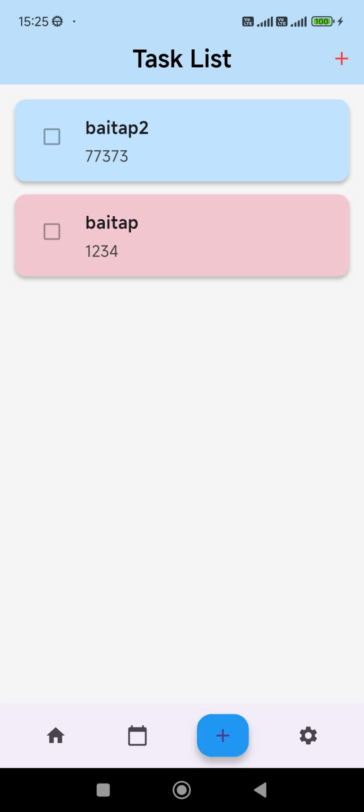

# UTH SmartTasks — Tuần 07 (Final)

Bài tập về nhà tuần 07: **Ứng dụng UTH SmartTasks**, xây dựng màn hình theo kiến trúc **MVVM**, và lưu trữ dữ liệu **offline** 

<h2>Demo (UI theo đề)</h2>

<div style="display: flex; gap: 20px;">

  <div style="text-align: center;">
    <p><strong>List – Danh sách task</strong></p>
    
  </div>

  <div style="text-align: center;">
    <p><strong>Add New – Thêm task</strong></p>
    
  </div>

</div>

## Tính năng

- **MVVM chuẩn**:
  - **View**: `lib/screens/*`
  - **ViewModel**: `lib/viewmodels/*`
  - **Repository**: `lib/repositories/*`
  - **Local Database**: `lib/database/database_helper.dart`
- **Offline-first**:
  - Lưu/đọc task từ **SQLite (`sqflite`)**
  - Danh sách **tự cập nhật** qua `Stream` (ViewModel subscribe)
- **CRUD**:
  - Thêm task
  - Xem danh sách
  - Xem chi tiết
  - Xoá task

## Tech stack

- Flutter (Dart)
- `provider` (state management)
- `sqflite` + `path` (SQLite local database)
- `sqflite_common_ffi` (để chạy SQLite trên desktop Windows/Linux/macOS)

## Cấu trúc thư mục

```
lib/
  database/
    database_helper.dart        # SQLite helper (CRUD + stream)
  models/
    task.dart                   # Task model
  repositories/
    task_repository.dart        # Repository layer
  screens/
    task_list_screen.dart       # List UI
    add_new_screen.dart         # Add New UI
    task_detail_screen.dart     # Detail UI
  sqflite_init/
    sqflite_init.dart           # Platform-safe init
    sqflite_init_io.dart        # Desktop init (FFI)
    sqflite_init_stub.dart      # No-op for non-IO platforms
  viewmodels/
    task_list_viewmodel.dart    # Load + stream subscribe
    add_task_viewmodel.dart     # Add task
```

## Cách chạy project

### 1) Cài dependencies

```bash
flutter pub get
```

### 2) Run trên Android (khuyến nghị)

```bash
flutter run
```

### 3) Run trên Web (Chrome/Edge)

```bash
flutter run -d chrome
```

### 4) Run trên Windows desktop

```bash
flutter run -d windows
```


```bash
flutter doctor -v
```

## Tác giả

- Tên: Trần Tiến Danh
- MSSV: 060205002269
